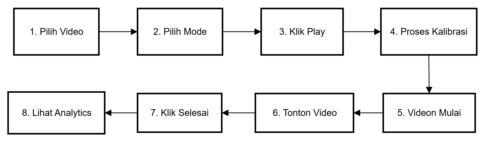

# Panduan Penggunaan Aplikasi Web Eye-Tracking Video Pembelajaran

## Daftar Isi

1. [Pengenalan Aplikasi](#-pengenalan-aplikasi)
2. [Persyaratan Sistem](#-persyaratan-sistem)
3. [Memulai Aplikasi](#-memulai-aplikasi)
4. [Panduan Langkah demi Langkah](#-panduan-langkah-demi-langkah)
5. [Mode Tracking](#-mode-tracking)
6. [Proses Kalibrasi](#-proses-kalibrasi)
7. [Menonton Video dengan Eye Tracking](#-menonton-video-dengan-eye-tracking)
8. [Dashboard Analytics](#-dashboard-analytics)
9. [Tips untuk Hasil Terbaik](#-tips-untuk-hasil-terbaik)
10. [Troubleshooting](#-troubleshooting)

---

## Pengenalan Aplikasi

Web Eye-Tracking adalah aplikasi berbasis web yang dirancang untuk mendeteksi dan menganalisis fokus pengguna saat menonton video pembelajaran. Aplikasi ini menggunakan teknologi pelacakan mata (eye tracking) melalui webcam untuk:

- Mendeteksi apakah pengguna fokus atau tidak saat menonton
- Merekam arah pandangan secara real-time
- Menghasilkan analisis visual tentang pola perhatian
- Menyimpan data untuk evaluasi pembelajaran

---

## Persyaratan Sistem

### Hardware
| Komponen | Minimum | Rekomendasi |
|----------|---------|-------------|
| Webcam | 720p | 1080p atau lebih tinggi |
| RAM | 4 GB | 8 GB atau lebih |
| Prosesor | Dual-core | Quad-core atau lebih |
| Koneksi Internet | Stabil | Stabil |

### Software
| Komponen | Keterangan |
|----------|------------|
| Browser | Google Chrome atau Microsoft Edge (versi terbaru) |
| Izin Kamera | Harus diaktifkan di browser |

### Lingkungan
- Pencahayaan: Ruangan dengan cahaya cukup, hindari backlight
- Posisi: Wajah terlihat jelas di kamera
- Jarak: Sekitar 50-70 cm dari layar

---

## Cara Menjalankan Aplikasi

### Langkah 1: Akses Aplikasi
Buka browser dan akses URL aplikasi yang diberikan oleh administrator.

```http://localhost:3000```

### Langkah 2: Izinkan Akses Kamera
Saat pertama kali mengakses, browser akan meminta izin untuk menggunakan kamera.

1. Klik "Allow" atau "Izinkan" pada popup yang muncul
2. Pastikan tidak ada aplikasi lain yang sedang menggunakan kamera

> **Penting:** Tanpa izin kamera, eye tracking tidak dapat berfungsi.
---

## Panduan Langkah demi Langkah

### Alur Penggunaan Utama



---

## Mode Tracking

Aplikasi menyediakan 3 mode tracking yang dapat dipilih:

### 1. MediaPipe Only
| Aspek | Keterangan |
|-------|------------|
| Teknologi | MediaPipe FaceMesh |
| Fungsi | Mendeteksi posisi pupil dan fokus |
| Output | Arah pandangan (Kanan, Kiri, Atas, Bawah, Tengah) + Status fokus |
| Kalibrasi | 5 detik melihat ke tengah layar |
| Kelebihan | Cepat, ringan, akurasi tinggi untuk deteksi fokus |

### 2. WebGazer Only
| Aspek | Keterangan |
|-------|------------|
| Teknologi | WebGazer.js |
| Fungsi | Melacak posisi pandangan di layar |
| Output | Koordinat X, Y di layar + Region layar |
| Kalibrasi | Klik 9 titik (masing-masing 5 kali) |
| Kelebihan | Posisi pandangan lebih presisi |

### 3. Combined (MediaPipe + WebGazer)
| Aspek | Keterangan |
|-------|------------|
| Teknologi | Kombinasi keduanya |
| Fungsi | Deteksi fokus + Posisi pandangan di layar |
| Output | Data lengkap dari kedua sistem |
| Kalibrasi | MediaPipe (5 detik) + WebGazer (9 titik) |
| Kelebihan | Data paling lengkap dan akurat |

### Cara Memilih Mode

1. Pada halaman utama, temukan dropdown "Mode"
2. Klik dropdown dan pilih mode yang diinginkan
3. Mode akan aktif saat video mulai diputar

---

## Proses Kalibrasi

### Kalibrasi MediaPipe

Durasi: 5 detik

**Langkah-langkah:**
1. Setelah klik play, akan muncul layar kalibrasi
2. Tampilan akan menunjukkan countdown timer
3. Pandang titik tengah layar selama countdown
4. Jangan gerakkan kepala
5. Setelah selesai, video akan otomatis mulai

> Tips: Pastikan wajah Anda terlihat jelas di kamera dan posisi stabil.

### Kalibrasi WebGazer

Durasi: Tergantung kecepatan klik (~1-2 menit)

**Langkah-langkah:**
1. Akan muncul 9 titik merah di layar (grid 3×3)
2. Satu titik akan aktif (lebih besar/berkedip)
3. Lihat ke titik tersebut dan klik 5 kali
4. Setelah 5 klik, titik berikutnya akan aktif
5. Ulangi hingga semua 9 titik selesai
6. Video akan mulai setelah kalibrasi selesai

**Posisi 9 Titik Kalibrasi:**
```
┌─────────────────────────┐
│  1        2        3    │
│                         │
│  4        5        6    │
│                         │
│  7        8        9    │
└─────────────────────────┘
```

> **Penting:** Klik tepat pada titik yang aktif sambil memandangnya. Jangan menggeser pandangan saat mengklik.

---

## Menonton Video dengan Eye Tracking

### Memilih Video

1. Pada halaman utama, temukan dropdown "Video"
2. Klik dropdown untuk melihat daftar video tersedia:
   - Biologi - Redominasi
   - FAPERTA - Dasar Genetika
   - FIKOM - Analisis
   - FIKOM - Gravity
   - FIKOM - Model Komunikasi
3. Pilih video yang ingin ditonton

### Memulai Tracking

1. Klik tombol "Play" di tengah video
2. Proses kalibrasi akan dimulai (sesuai mode)
3. Video akan masuk ke mode "fullscreen" secara otomatis
4. Tracking aktif - perhatikan titik hijau/merah di layar:
   - 🟢 Hijau: Fokus terdeteksi
   - 🔴 Merah: Tidak fokus

### Selama Menonton

| Kontrol | Fungsi |
|---------|--------|
| *Play/Pause* | Klik video atau tombol pause |
| *Slider Durasi* | Geser untuk lompat ke bagian tertentu |
| *Fullscreen Toggle* | Tombol di pojok kanan bawah |

> **Reminder Fullscreen:** Jika Anda keluar dari fullscreen, akan muncul banner pengingat untuk kembali ke mode fullscreen agar tracking optimal.

### Mengakhiri Sesi

1. Setelah selesai menonton, klik tombol "Selesai"
2. Data tracking akan disimpan
3. Anda dapat melihat hasil analisis di halaman "Analytics"

---

##  Dashboard Analytics

Akses halaman Analytics untuk melihat hasil analisis eye tracking Anda.

### Cara Mengakses :
Navigasi ke `/analytics` atau klik link "Analytics" di halaman utama.

### Komponen Visualisasi

#### 1. Focus Metrics
Metrik-metrik utama tentang fokus Anda:

| Metrik | Keterangan |
|--------|------------|
| *Focus Percentage* | Persentase waktu fokus (ditampilkan dalam ring chart) |
| *Total Focus Time* | Total durasi Anda dalam kondisi fokus |
| *Distraction Count* | Jumlah kali Anda kehilangan fokus |
| *Longest Focus Streak* | Durasi fokus terlama tanpa terdistraksi |
| *Avg Focus Duration* | Rata-rata durasi setiap periode fokus |
| *Watch Duration* | Total durasi video yang ditonton |

#### 2. Gaze Heatmap
Peta panas yang menunjukkan area mana yang paling sering Anda lihat.

- *Warna Merah/Kuning*: Area yang sering dilihat (poin tinggi)
- *Warna Biru*: Area yang jarang dilihat (poin rendah)
- *Grid 6×9*: Membagi layar menjadi 54 zona

#### 3. Attention Timeline
Grafik batang yang menunjukkan tingkat fokus sepanjang durasi video.

- *Sumbu X*: Waktu video (detik)
- *Sumbu Y*: Skor fokus (0-100%)
- *Warna Hijau*: Fokus tinggi
- *Warna Kuning*: Fokus sedang
- *Warna Merah*: Fokus rendah

#### 4. Region Distribution Chart
Visualisasi distribusi pandangan per region layar.

- Grid 3×3 menunjukkan persentase per area
- Bar chart menampilkan top 5 region dengan waktu pandang terlama

### Demo Mode
Jika belum ada data session, klik tombol "Load Demo Data" untuk melihat contoh visualisasi.

---

## Tips untuk Hasil Bagus

### Persiapan Sebelum Tracking

1. **Pencahayaan yang Baik**
   - Gunakan ruangan dengan cahaya cukup
   - Hindari sumber cahaya di belakang Anda (backlight)
   - Cahaya sebaiknya datang dari depan atau samping

2. **Posisi Kamera**
   - Pastikan wajah terlihat penuh di kamera
   - Posisikan kamera sejajar dengan mata
   - Jarak ideal: 50-70 cm dari layar

3. **Kondisi Wajah**
   - Lepas kacamata jika memungkinkan (dapat mengurangi akurasi)
   - Hindari topi atau penutup kepala yang menghalangi wajah

### Selama Tracking

1. **Jaga Posisi Stabil**
   - Minimalisir gerakan kepala
   - Jika perlu bergerak, lakukan perlahan

2. **Tetap di Mode Fullscreen**
   - Jangan keluar dari fullscreen
   - Jika keluar, segera kembali saat muncul reminder

3. **Fokus pada Konten**
   - Tonton video secara natural
   - Jangan berusaha "mengakali" sistem

---

## Troubleshooting

### Masalah Umum dan Solusi

#### Kamera Tidak Terdeteksi
**Penyebab:** Izin kamera tidak diberikan atau kamera sedang digunakan.

**Solusi:**
1. Periksa izin kamera di pengaturan browser
2. Tutup aplikasi lain yang menggunakan kamera
3. Refresh halaman dan izinkan akses kamera

#### Tracking Tidak Akurat
**Penyebab:** Kondisi pencahayaan buruk atau posisi tidak optimal.

**Solusi:**
1. Perbaiki pencahayaan ruangan
2. Posisikan wajah agar terlihat jelas di kamera
3. Lakukan kalibrasi ulang

#### Video Tidak Dapat Diputar
**Penyebab:** Format video tidak didukung atau file rusak.

**Solusi:**
1. Coba video lain dari daftar
2. Refresh halaman
3. Hubungi administrator

#### Data Tidak Tersimpan
**Penyebab:** Session berakhir tidak normal atau browser ditutup.

**Solusi:**
1. Pastikan klik tombol "Selesai" sebelum menutup
2. Jangan tutup tab browser selama tracking
3. Data tersimpan di sessionStorage (hilang jika tab ditutup)

#### Kalibrasi Gagal
**Penyebab:** Wajah tidak terdeteksi atau posisi tidak stabil.

**Solusi:**
1. Pastikan wajah terlihat jelas di kamera
2. Jangan bergerak selama kalibrasi
3. Ulangi proses dari awal